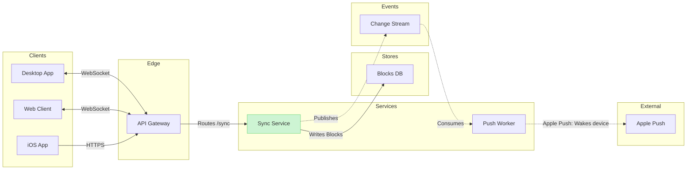

```mermaid
%% type: architecture
flowchart LR
    subgraph client ["Clients"]
        desktop[Desktop App]
        webClient[Web Client]
        ios[iOS App]
    end
    subgraph gateway ["Edge"]
        api[API Gateway]
    end
    subgraph service ["Services"]
        sync[Sync Service]
        push[Push Worker]
    end
    subgraph datastore ["Stores"]
        blocks[Blocks DB]
    end
    subgraph async ["Events"]
        changes[Change Stream]
    end
    subgraph external ["External"]
        apns[Apple Push]
    end
    desktop <-->|"WebSocket"| api
    webClient <-->|"WebSocket"| api
    ios -->|"HTTPS"| api
    api -->|"Routes /sync"| sync
    sync -->|"Writes Blocks"| blocks
    sync -.->|"Publishes"| changes
    changes -.->|"Consumes"| push
    push -.->|"Apple Push: Wakes device"| apns
    style sync fill:#CDF4D3,stroke:#66D575
```
